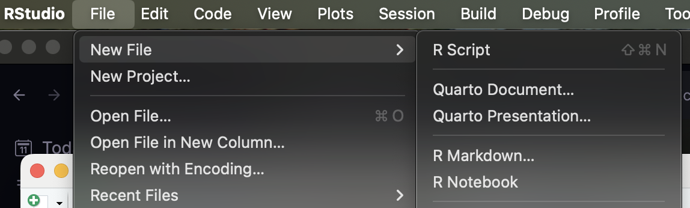

# The `R` Ecosystem

This course will use `R` for model exploration, data analysis, and writing results.  If you do not have `R` on your laptop, please download it from [here](https://cran.r-project.org) and install the appropriate version for your platform.


### R Version

:::{.callout-info}
I am currently using R version `r paste( version$major, version$minor, sep=".")` for this document.  
:::

To check the version of your `R` instance, type:

```{r}
version
```

If the major version of your install is `r version$major`, you should be fine.  If it is earlier, you should upgrade.  If the first number in the minor version is lower than this, you should also consider upgrading.  The minor "dot version" is not as important.

#### Upgrading from a Previous Version

`R` stores all the libraries in a version-specific folder structure.  *Before* you upgrade, you may want to make a backup of which sets of libraries/packages you have installed already so that when you upgrade, you can automatically reinstall the packages into the new system.  Here is how you'd do that.

1. Make a record of the packages you already have installed.  This takes the list of packages you have, pulls out the names of each package and saves it as an R data file (`.rda`) on your Desktop.  After this, you can close R.

```{r}
#| eval: false
pkgs <- installed.packages()
pkgs <- names( is.na(pkgs[,4]))
save(pkgs,file='~/Desktop/pkgs.rda')
```

2. Download and Install the new version of `R`.  

:::{.callout-warning}
If you are on Windows... I'm sorry, I feel for you.  Make sure you install the `UCRT` package that is in the `base` install documents.  There may be other issues that come up, I am not familiar with this platform but in almost all the workshops I lead, there are Windows issues.
:::

3. Find the packages you need to install by comparing it to what you had previously and install them all at once.


```{r}
#| eval: false
new_pkgs <- installed.packages()
new_pkgs <- names( is.na(new_pkgs[,4]))
load("~/Desktop/pkgs.rda")
to_install <- setdiff( pkgs, new_pkgs )
install.packages( to_install )
update.packages( ask=FALSE )
```


#### Updating your current set of packages.

If you just updated `R`, you can skip this section.  If you have not updated your package list in a while, you may want to update any out-of-date packages you may have on your system.  Do this when you are not needing to use `R` for a while, depending upon how much you need to upgrade, it may take a while.

```{r}
#| eval: false
update.packages( ask=FALSE )
```

If you do not put the `ask=FALSE` part in there, you'll be tethered to the computer because it will ask your permission to install each package one at a time...  


## RStudio

I am assuming that you are using [RStudio](https://posit.co) for this course.  If you prefer to use another platform such as [Jupyter Notebooks](https://jupyter.org), [Visual Studio](https://code.visualstudio.com), or other IDE's, you are on your own.  However, this course will require you to produce markdown documents in HTML or DOCX format.

If you do not have the most recent version of RStudio, please download it from [here](https://posit.co)


## Quarto

We are going to use [Quarto](https://quarto.org) in this course to make integrate our data analysis, graphical output, report writing.  If you have not used `quarto` before, you will need to download the most recent version.  There is a complete discussion of how to start with Quarto on the website.  Download the version for your compute platform and choose `RStudio` (or whatever IDE) you are using.  It will set you up.

# RStudio Projects

`RStudio` has the concept of a *project* for code and data organization.  I *highly recommend* that you use a single project for this course.  This will co-locate all the data, all the code, and all the markdown that you will be given and that you create for this class.  It will also seemlessly handle working directories and all the other crap that befuddles many students.  To make a new package, open up `RStudio` and do the following:


1. From the `File` menu, select `New Projct`


2. Select `New Directory` from the popup dialog. This will create a new folder to put all your materials into.


3. Select `New Project` for this, we are going to create a generic project to put all the course materials into.


4. Create a name for the folder, perhaps select the name of the class or some other designation that works with your file organization system.  Also, put it somewhere that will be useable (I had a student recently who only put stuff in the `Downloads` folder for some reason...).  


5. Select `Create Project`.

Now, whenever you get a document or data file, *put it in this folder*.  

:::{.callout-warning}
It is important for me to emphasize this.  When you download a data set or markdown document or R script and simply double click on it, it will most likely be in your Downloads folder.  

**Move it to the project folder** so it is co-located with all the other stuff for this course.  If you do not, some of the code may not work properly and you'll be hating yourself.  (Dyer's #1 rule, do things now so 'future self' does not hate decisions that 'past self' made...)
:::

More importantly, when `RStudio` opens, it will default to opening the most recent project (which in all likelihood will be this project).  


# Markdown

In `R`, we have two categories of documents that we will be using.  

## `R` Scripts


You can write pure `R` code in scripts, which are files that are executed one line at a time, identical to you typing it into the `R` console.  These files are saved with the suffix `.R`.  These are great for pure data manipulation and coding.  

To create an `R` Script select `File`$\to$`New File`$\to$`R Script`.  



To execute `R` code in a script, we can select `Source` or `Run` from the button at top of the `RStudio` editor window (just above the script itself).  Or, you can execute the code in a script from another location (e.g., from another script) using the function `source()` and passing it the path (relative to the document you are using right now) to the script.  It will then grab the code from the script and execute it as if it was part of this script.  

```{r}
#| eval: false
source("path_to/my_cool_script.R")
```

This is very helpful, particularly if you routinely get raw data that needs some preliminary QA/QC, you can set up a script that will clean it up and call it as necessary.  

:::{.callout-info}
It is important to think about compartmenatalization of your code.  If you ever find yourself typing or (worse yet) copy-and-pasting code you've used before into a new analysis—STOP.  One of our goals is to write *as few lines of code* as possible.  Errors (logical and grammatical) increase linearly with the number of lines of code you write.  The *D*ont *R*epeat *Y*ourself (*DRY*) principle is key to success in data analytics.  Refactor things for reuse will always be benefitical to you in the long run.
:::

One last thing.  When you write code in a script, use a lot of comments to explain what you are doing in the code.  Here is the syntax of a single line comment.

```{r}
# This is a comment and will not be interpreted by R
```

'Future self' will thank you when you come back to this file and try to figure out how to use it again.  


## Quarto Documents

The next kind of file we will be working with are quarto markdown documents.  These documents let you mix together the `R` code (like the scripts), graphical output, tabular output, and the larger narratives around data and analyses you are creating.  It is also possible to link the numerical values assocaited with an analysis to in-text values so that if the data change the text changes as well.  Figure and table numbering and citations are also updated automatically.  It is in your best interest (if your time is important to you) to become proficient in how markdown and `R` interact.

The document you are reading right here is a quarto document.  These files end in the file suffix `.qmd`.  

If you have not used markdown before, you need to jump in right now.  Here are some resources for you from a Data Literacy course I teach which will help you get up-to-speed on using Markdown in RStudio.  

- [Slides](https://dyerlabteaching.github.io/Markdown/slides.html) describing the rationale for Markdown and how to use it in RStudio where you can mix textual content with data, code, and output.  
- A longer [narrative](https://dyerlabteaching.github.io/Markdown/narrative.html) on the topic that goes into more depth than the slides that includes code and example output.
- A [Video](https://youtu.be/f50Hz92IyIQ) on Markdown and Notebooks in RStudio that I made during the COVID lockdown when teaching this course.
- External resources realted to using markdown:  
  - A basic [Markdown Cheatsheet](https://www.markdownguide.org/cheat-sheet/)  
  - A site based upon [RMarkdown](https://rmarkdown.rstudio.com/) with examples.
  - The official documentation for [Quarto](https://quarto.org/docs/guide/) (which is the main interface we will be using).


# Data Maniuplation

If we look at the amount of time we allocate to our data analytics, the vast majority of it is spent on working on the data, manipulating it, getting it into a format that is usable, and a very small fraction of it is spent on running an actual analysis.  Usually, by the time we get to the analysis, we are doing a simple function call with our formatted data.

```{r}
#| eval: false
analysis( myData )
```

I am hoping that you are versed in using `tidyverse` for data manipulation.  This is a constellation of packages that help you take raw data (genotypes, rasters, shapefiles, csv files, etc.) and perform operations on it.  Loading in `tidyverse` is done by calling the library directly.

```{r}
library( tidyverse )
```

If you are getting a "library not found" for this, install it using the following.

```{r}
#| eval: false
install.packages( "tidyverse" )
```

Here is an example of how it can be used to summarize data from the built-in *Iris* data set.

```{r}
summary( iris )
```

The following code does the following:  
- outputs the raw data. 
- creates a new column of data with genus and species. 
- groups by species. 
- summarizes by taking the mean values for petal length and width. 
- saves as a `data.frame` to a local variable.  

```{r}
iris |>
  mutate( Plant = paste( "Iris",Species)) |>
  group_by( Plant ) |>
  summarize( Length = mean( Petal.Length ), 
             Width = mean( Petal.Width ) ) -> iris_summary
```

And this is what the output looks like.

```{r}
iris_summary 
```

If you were unsure what the output of the code was going to look like or do not understand what was done, you may need to work a bit on getting up to speed on `tidyverse`.

Here are some resources on using `tidyverse` from a few different sources.  

 - A [Video](https://youtu.be/dUZyOhVGOjo?si=BvbznIeub7D_cHNX) introducing `tidyverse` given from a distributed workshop on Landscape Genetics.  
 - Updated [Slides](https://dyerlabteaching.github.io/Tidyverse/slides.html#/title-slide) of the content.  These are updated from the set in the video as they are the ones I used last semseter.  
 - A larger [narrative](https://dyerlabteaching.github.io/Tidyverse/narrative.html) going into more depth on the specifics of the topic.  
 - The data set we will use for this is the Rice Rivers Center data set (from 2014).  You can see it here as its normal [Google Sheets](https://docs.google.com/spreadsheets/d/1Mk1YGH9LqjF7drJE-td1G_JkdADOU0eMlrP01WFBT8s/edit?usp=sharing) or as a [CSV](https://docs.google.com/spreadsheets/d/1Mk1YGH9LqjF7drJE-td1G_JkdADOU0eMlrP01WFBT8s/pub?gid=0&single=true&output=csv) file.  
 - A [cheat sheet](https://github.com/rstudio/cheatsheets/raw/main/data-transformation.pdf) going over the basic analysis verb functions from `dplyr`.  


# Graphics

Part of the `tidyverse` is the `ggplot2` library.  This is the primary and dominant graphing output for `R` and will be used throughout this course.  You should be familiar with the code sets below (enough to understand what they are doing) and be able to produce basic data graphics.

```{r}
#| echo: false 
theme_set( theme_minimal() )

```


A basic scatter plot with groupings and a trend line (@fig-scatter).

```{r}
#| label: fig-scatter
#| fig-cap: "The relationship between petal length and width for three iris species (indicated by alternative colors) with linear trendline (in gray)."

iris |> 
  ggplot( aes(Petal.Width, Petal.Length ) ) + 
  stat_smooth( formula = y~x,
               method="lm",
               se=FALSE, col="gray", 
               lwd=0.5, lty=2 ) + 
  geom_point( aes( color = Species ) ) +
  xlab("Petal Width (mm)") +
  ylab("Petal Length (mm)")
```


A categorical data output using `boxplot()` (@fig-boxplot) or `violin()` (@fig-violin) display to compare continuous responses from factors.


```{r}
#| label: fig-boxplot
#| fig-cap: "A boxplot plot of sepal length for three iris species."

iris |> 
  ggplot( aes(Species,Petal.Length) ) + 
  geom_boxplot(notch=TRUE) +  
  xlab("Iris species") +
  ylab("Petal Length (mm)")
```


```{r}
#| label: fig-violin
#| fig-cap: "A violin plot of sepal length overlain with individual measurements for three iris species."

iris |> 
  ggplot( aes(Species,Petal.Length) ) + 
  geom_violin() + 
  geom_jitter( width = 0.05, alpha = 0.5) +
  xlab("Iris species") +
  ylab("Petal Length (mm)")
```

A representation of the distribution of variables (@fig-density) across different groups.

```{r}
#| label: fig-density
#| fig-cap: "Probability density of petal length for three iris species."
iris |>
  ggplot( aes(Sepal.Length, fill=Species) ) + 
  geom_density( alpha = 0.75, col="darkgray") +
  xlab("Iris species") +
  ylab("Petal Length (mm)") + 
  xlim( c(3,9) )
```

If these methods are new to you, here are some resources that will help.

 - Slides for [classic plotting](https://dyerlabteaching.github.io/Graphics-That-Do-Not-Suck/slides_classic.html) and for [ggplot2](https://dyerlabteaching.github.io/Graphics-That-Do-Not-Suck/slides.html) plotting.
 - The narrative for both [classic plotting](https://dyerlabteaching.github.io/Graphics-That-Do-Not-Suck/narrative_classic.html) as well as for [ggplot2](https://dyerlabteaching.github.io/Graphics-That-Do-Not-Suck/narrative.html) graphics
 - [In Class](https://dyerlabteaching.github.io/Graphics-That-Do-Not-Suck/in-class.html) documents.
 - External resources:
   - [Date to Viz](https://www.data-to-viz.com).
   - [R Graph Gallery](https://r-graph-gallery.com/ggplot2-package.html)
   - [GGPlot2 Cheatsheet](https://raw.githubusercontent.com/rstudio/cheatsheets/main/data-visualization.pdf)

# Tabular Output

The last part of this review will focus on tabular output.  Many times, we have data we need to summarize (see above the `tidyverse` example data that produced a `data.frame` of mean petal sizes) and would like to create a table in our document that will present the results to the reader (or an ANOVA table or whatever).  The most common approach in `R` is to use the following:

```{r}
#| messages: false
library( knitr )
library( kableExtra )
```

Here is the data from above:

```{r}
iris_summary
```

We can make this into a table for publication output as is (@tbl-iris).

```{r}
#| label: tbl-iris
#| tbl-cap: "Mean dimensions for petals sampled from 50 indiviudals in each iris species."
iris_summary |>
  kable() |>
  kable_styling( bootstrap_options = c("striped", "hover", "condensed", "responsive") ) |>
  add_header_above(c(" " = 1, "Mean Petal Measurement (mm)"=2) ) |>
  footnote(general="N = 50 per species.", footnote_as_chunk = TRUE)
 
```

There is a great webpage for `kableExtra` that describes a lot of additional functionality for this library [here](https://cran.r-project.org/web/packages/kableExtra/vignettes/awesome_table_in_html.html).  I recommend you take a look  at it.

# Conclusion

So this should be sufficient for what we need in this course.  If you have any concerns about your ability to do any of the above, please let me know and we can get to work on helping you get to where you need to be.

If you have any questions, feel free to drop by my office (LFSC 105c), jump onto my Office Hours Zoom (linked form [Canvas](https://canvas.vcu.ed)), or send me an [email](mailto://rjdyer@vcu.edu).

- DrD


